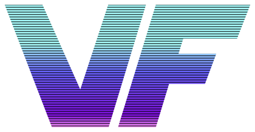
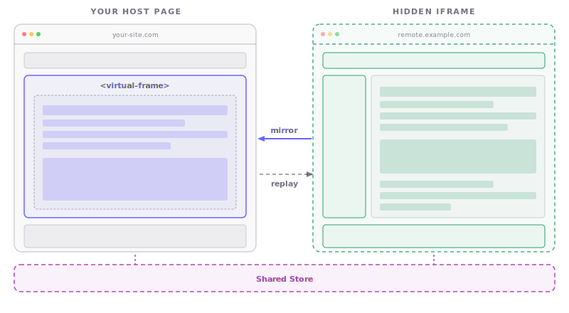

<p align="center">
  <a href="https://virtual-frame.level0x40.com">
    <picture>
      <source media="(prefers-color-scheme: dark)" srcset="docs/public/logo.svg">
      
    </picture>
  </a>
</p>

<h1 align="center">Virtual Frame</h1>

<p align="center">
  <a href="https://github.com/level0x40/virtual-frame/actions/workflows/ci.yml"></a>
  <a href="https://github.com/level0x40/virtual-frame/actions/workflows/codeql.yml"></a>
  <a href="https://securityscorecards.dev/viewer/?uri=github.com/level0x40/virtual-frame"></a>
  <a href="https://www.npmjs.com/package/virtual-frame"></a>
  <a href="LICENSE"></a>
</p>

<p align="center">
  <strong>Microfrontend projection for the modern web.</strong><br>
  Compose independently deployed applications into a unified interface &mdash;<br>
  with full interactivity, style isolation, and cross-origin support.
</p>

<p align="center">
  <a href="https://virtual-frame.level0x40.com">Documentation</a>&nbsp;&nbsp;&bull;&nbsp;&nbsp;<a href="https://virtual-frame.level0x40.com/guide/getting-started">Get Started</a>&nbsp;&nbsp;&bull;&nbsp;&nbsp;<a href="#examples">Examples</a>&nbsp;&nbsp;&bull;&nbsp;&nbsp;<a href="https://github.com/level0x40/virtual-frame">GitHub</a>
</p>

<br>

---

<br>

## The Problem

Enterprise frontends are no longer monoliths. They're assembled from dozens of independently owned services, teams, and deployment pipelines. Yet the tools for composing them are stuck in the past &mdash; containers that break layout flow, build-time coupling that kills team autonomy, or custom protocols that lock you into a single framework.

**Virtual Frame takes a different approach.** It _projects_ remote content directly into your DOM &mdash; fully interactive, style-isolated, and framework-agnostic. No build-time coordination. No layout traps. No vendor lock-in.

<br>

## Why Virtual Frame

### Ship Independently, Compose Seamlessly

Each team deploys on their own schedule. Virtual Frame projects their UI into a unified experience at runtime &mdash; no shared builds, no version conflicts, no deployment coordination.

### Any Framework. Any Origin. Any Content.

React, Vue, Angular, Svelte, Solid, Next.js, Nuxt, SvelteKit &mdash; it doesn't matter. Virtual Frame works with any web content from any origin. Bring your own stack.

### True DOM Integration

Projected content lives in your page's DOM flow. It participates in your layout, respects your scroll context, and behaves like native content &mdash; because it is.

### Enterprise-Grade Isolation

Shadow DOM encapsulation prevents style bleed between host and remote applications. Each projected surface is sandboxed without sacrificing interactivity or accessibility.

<br>

## Architecture

<p align="center">
  <picture>
    
  </picture>
</p>

<br>

## Key Capabilities

|                                  |                                                                                                     |
| -------------------------------- | --------------------------------------------------------------------------------------------------- |
| **Microfrontend Projection**     | Compose independently deployed apps into a single view &mdash; dashboards, widgets, entire pages    |
| **Framework Agnostic**           | First-class bindings for React, Vue, Svelte, Solid, Angular, and Next.js. Works with plain HTML too |
| **Shadow DOM Isolation**         | Prevents CSS bleed between projected content and the host page                                      |
| **Selector Projection**          | Project only the parts you need using CSS selectors &mdash; a chart, a form, a sidebar              |
| **Shared Reactive Store**        | Synchronized state between host and remote apps via `@virtual-frame/store`                          |
| **Cross-Origin Support**         | Compose content from any origin using a lightweight bridge script                                   |
| **Canvas & Media Streaming**     | Live canvas and video content projected in real-time                                                |
| **Full Interactivity**           | Clicks, forms, scroll, drag & drop &mdash; all proxied transparently to the source                  |
| **Module Federation Compatible** | Works alongside Webpack/Rspack Module Federation for hybrid composition                             |

<br>

## Quick Start

```sh
npm install virtual-frame
```

**That's it.** No build plugins. No config files. No framework buy-in.

### HTML Custom Element

```html
<script type="module">
  import "virtual-frame/element";
</script>

<virtual-frame
  src="https://other-team.example.com/widget"
  isolate="open"
></virtual-frame>
```

### React

```sh
npm install virtual-frame @virtual-frame/react @virtual-frame/store
```

```jsx
import { VirtualFrame, useVirtualFrame, useStore } from "@virtual-frame/react";
import { createStore } from "@virtual-frame/store";

const store = createStore();

function App() {
  const count = useStore(store, ["count"]);
  const frame = useVirtualFrame("/remote/", { store });

  return (
    <>
      <p>Count: {count ?? 0}</p>
      <VirtualFrame frame={frame} selector="#counter" />
    </>
  );
}
```

### JavaScript API

```js
import { VirtualFrame } from "virtual-frame";

const vf = new VirtualFrame(sourceFrame, host, {
  isolate: "open",
  selector: "#main-content",
});
```

> Bindings also available for **Vue**, **Svelte**, **Solid**, **Angular**, and **Next.js** &mdash; see the [full documentation](https://virtual-frame.level0x40.com/guide/getting-started).

<br>

## Shared Reactive Store

`@virtual-frame/store` provides an event-sourced synchronized store that keeps state in sync between host and remote applications in real time. Read and write like a plain object &mdash; synchronization happens automatically.

```js
import { createStore } from "@virtual-frame/store";

const store = createStore();

store.count = 0;
store.user = { name: "Alice" };

console.log(store.count); // 0
console.log(store.user.name); // "Alice"
```

When passed to a `VirtualFrame` component, the store automatically synchronizes between the host and the remote. Both sides see the same state and updates propagate instantly.

- **Proxy-based API** &mdash; read and write like a plain object
- **Event-sourced** &mdash; every mutation is an immutable operation in an append-only log
- **Deterministic sync** &mdash; operations are totally ordered by `(timestamp, sourceId, seq)`
- **Microtask-batched** &mdash; multiple writes in the same tick produce one subscriber notification
- **Framework-native bindings** &mdash; `useStore` hooks for React, Vue, Svelte, Solid, and Angular

<br>

## Packages

| Package                                      | Description                                            |
| -------------------------------------------- | ------------------------------------------------------ |
| [`virtual-frame`](packages/core)             | Core library and `<virtual-frame>` custom element      |
| [`@virtual-frame/store`](packages/store)     | Event-sourced synchronized store for cross-frame state |
| [`@virtual-frame/react`](packages/react)     | React component and `useStore` hook                    |
| [`@virtual-frame/vue`](packages/vue)         | Vue component and `useStore` composable                |
| [`@virtual-frame/svelte`](packages/svelte)   | Svelte component and `useStore` readable store         |
| [`@virtual-frame/solid`](packages/solid)     | Solid component and `useStore` signal                  |
| [`@virtual-frame/angular`](packages/angular) | Angular directive and `injectStoreValue` signal        |
| [`@virtual-frame/next`](packages/next)       | Next.js integration (App Router & Pages Router)        |

<br>

## Examples

Every major framework. Host + remote pairs. Ready to run.

| Example                                               | Stack                           | Command                       |
| ----------------------------------------------------- | ------------------------------- | ----------------------------- |
| [Vanilla](examples/vanilla)                           | Plain HTML/JS                   | `pnpm example:vanilla`        |
| [React](examples/react-host)                          | React + shared store            | `pnpm example:react`          |
| [Vue](examples/vue)                                   | Vue 3                           | `pnpm example:vue`            |
| [Svelte](examples/svelte)                             | Svelte 5                        | `pnpm example:svelte`         |
| [Solid](examples/solid)                               | SolidJS                         | `pnpm example:solid`          |
| [Angular](examples/angular)                           | Angular 19                      | `pnpm example:angular`        |
| [Next.js App Router](examples/nextjs-app-host)        | Next.js 16 (App Router)         | `pnpm example:nextjs-app`     |
| [Next.js Pages Router](examples/nextjs-pages-host)    | Next.js 16 (Pages Router)       | `pnpm example:nextjs-pages`   |
| [Nuxt](examples/nuxt-host)                            | Nuxt 4                          | `pnpm example:nuxt`           |
| [React Router](examples/react-router-host)            | React Router 7                  | `pnpm example:react-router`   |
| [TanStack Start](examples/tanstack-start-host)        | TanStack Start                  | `pnpm example:tanstack-start` |
| [Analog](examples/analog-host)                        | Analog (Angular meta-framework) | `pnpm example:analog`         |
| [SvelteKit](examples/sveltekit-host)                  | SvelteKit 2                     | `pnpm example:sveltekit`      |
| [SolidStart](examples/solid-start-host)               | SolidStart                      | `pnpm example:solid-start`    |
| [Rspack + Module Federation](examples/rspack-mf-host) | Rspack MF v2 hybrid             | `pnpm example:rspack-mf`      |

<br>

## Cross-Origin

For content served from a different origin, include the bridge script in the remote page:

```html
<script src="https://unpkg.com/virtual-frame/dist/bridge.js"></script>
```

Virtual Frame automatically detects cross-origin sources and activates the bridge. No server proxy or CORS configuration required.

<br>

## Contributing

We welcome contributions of all kinds &mdash; bug reports, feature requests, documentation improvements, and code.

Before submitting a pull request, please make sure your changes pass the full quality pipeline:

```sh
pnpm install        # Install dependencies
pnpm build          # Build all packages
pnpm test           # Unit tests (Vitest + browser mode)
pnpm test:e2e       # End-to-end tests (Playwright)
pnpm lint           # Lint with oxlint
pnpm format:check   # Check formatting with oxfmt
pnpm typecheck      # TypeScript type checking
```

Run the full example suite in development mode to verify integration across frameworks:

```sh
pnpm dev            # All examples in parallel
```

See the [documentation site](https://virtual-frame.level0x40.com) for architecture guides and API reference.

<br>

## License

Source Available License (SAL-1.0). See [LICENSE](LICENSE) for details.

<br>

---

<br>

<p align="center">
  <a href="https://level0x40.com">
    <picture>
      <source media="(prefers-color-scheme: dark)" srcset="docs/public/lvl-logo.svg">
      
    </picture>
  </a>
</p>

<p align="center">
  Virtual Frame is created and maintained by <a href="https://level0x40.com"><strong>Level 0x40 Labs</strong></a> &mdash; building the next generation of web composition infrastructure.
</p>

<p align="center">
  <a href="https://virtual-frame.level0x40.com">Website</a>&nbsp;&nbsp;&bull;&nbsp;&nbsp;<a href="https://github.com/level0x40/virtual-frame">GitHub</a>&nbsp;&nbsp;&bull;&nbsp;&nbsp;<a href="https://level0x40.com">Level 0x40 Labs</a>
</p>
